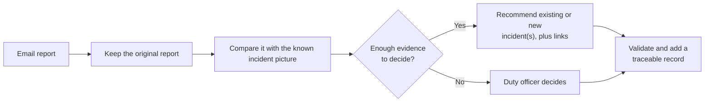
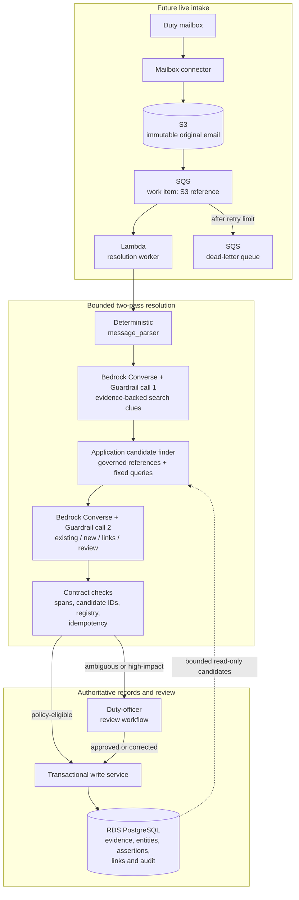

# Production service design

The goal is to turn email reports into a traceable incident picture without
hiding uncertainty or losing the evidence behind a decision.

## What the service changes

This first view shows the service as a duty officer should experience it.

The original email remains evidence. Every recommendation retains its sender,
reported time and supporting words, so an officer can inspect where it came
from.

Email-format handling remains deterministic in `message_parser`. A model is
introduced only in `incident_extractor`, where varied language must be
interpreted against a changing incident history.

## Target AWS architecture

This is the future live topology, subject to accreditation for the mailbox's
information classification. The roadmap below deliberately defers its intake.

Fixed read-only queries supply bounded candidates. Neither model call
has database credentials or arbitrary-query access.

Encrypted S3 preserves exact email evidence before queuing. Database uniqueness
on source-message identity and derivation version makes concurrent retries/replay
no-ops.

Call 1 returns cited mentions, type and time clues—not canonical IDs.
Application code resolves zero or many governed candidates and runs a broad,
size-limited incident search.

An empty narrow search is not proof of a new incident. Call 2 compares the
evidence with the candidates and returns `existing`, `new` or `needs_review`,
plus typed links to other incidents.

Application code checks cited spans exist, selected IDs were retrieved and the
registry permits proposed types, predicates and links.

Each Bedrock Converse call applies a versioned Guardrail to extracted untrusted
email, attachment and retrieved text, plus model output. Inputs use
`guardContent`; blocks enter review.

Neither checks nor Guardrails prove a semantic match. IAM and fixed read-only
queries enforce authority; uncertain or high-impact decisions enter review.

Only the writer has database write credentials. An append-only decision audit
records caller, source spans, candidates, model/prompt/Guardrail/schema/registry
versions, authorisation, validation, blocks and review outcomes.

Configured CloudTrail trails record management and required data events.
Bedrock invocation logs, where classification permits, use encrypted,
access-restricted sinks and controlled retention.

## Generalising beyond Part A

Part A uses fixed vocabularies and line rules. The target keeps a stable core:
canonical entities and aliases, immutable assertions, typed links and reviews.

| Part A compromise | Production response |
|---|---|
| Closed types, aliases and predicates | A versioned registry defines entities, relationships and metrics with datatype, unit, scope, modality and time. Owners govern sources, licences, aliases, merges and effective dates. |
| One positional incident and unanchored measurements | Incident assignment becomes evidence-backed, many-to-many and hierarchical, with provisional states and typed `caused_by`/`contributes_to`/`related_to` links. Unresolved measurements retain evidence and enter review. |
| Body-only, line-based extraction | Layout, quoted/forwarded, table, attachment and relative-time processors share one assertion contract. Parent part, claim author, forwarding sender, source span and original time phrase survive; gaps remain typed issues. |
| Fixed organisation roles and no site lifecycle | Roles, actions and lifecycle changes are time-bound, message-attributed assertions. Sites can change role; roads can resolve to segments. |
| Resends and duplicate representations | Source-message idempotency stays separate from semantic message and assertion grouping, preserving evidence without double-counting. |

A new type normally needs a steward-approved registry change, reference mapping
and labelled examples. The resolver reads the active catalogue at runtime;
pipeline changes or retraining are normally unnecessary.

Each version must pass replay. New structure or access rules still require a
migration. The resolver may propose but cannot publish entries.

Sensitive, urgent, materially conflicting or ambiguous candidates enter review
under classification-specific access and retention.

Corrections never overwrite. Raw wording and scope survive beside comparable
unit, population, geography and effective-time fields. Assertions link as
`qualifies`, `supersedes` or `contradicts`, retaining both evidence spans.

A versioned “current picture” view applies duty-officer-approved temporal,
spatial, source and review rules. It shows competing reports when those rules
cannot support one answer.

## Proving it is trustworthy

Historical mail and officer spreadsheets form widening backfill windows. Each
new window is held out; every model, prompt, Guardrail, schema, registry or
retrieval change replays prior windows.

Execution traces of both calls, retrieval and validation are emitted through
OpenTelemetry to AgentCore Evaluations.

Code evaluators score contracts and candidate coverage; an LLM judge assesses
evidence grounding. Officer adjudication remains the quality gate.

Because spreadsheets hold conclusions and are overwritten, officers adjudicate
a smaller evidence-spanned set. Disagreement triggers review, not an assumed
model defect.

| Stage | Evidence of quality |
|---|---|
| Backfill window | Measure clue/span accuracy, candidate coverage, existing/new/link precision and recall, facts/time/contradictions, false merges/splits and abstention. |
| Security | Attack-test bodies, quotes, attachments and retrieval; verify Guardrail routing, query bounds, audit completeness and no unauthorised read/write. |
| Controlled replay | Officers adjudicate every proposal; disagreement enters review, with no operational changes. |
| Eventual live use | Track corrections, abstention, time saved, backlog, drift by sender/template, latency and cost. |

Duty officers set numeric targets before a pilot. Hard gates include correct
attribution and zero false merges in the agreed high-severity evaluation set.

Numeric facts favour precision over recall. No adversarial test may cause an
out-of-scope read or write.

Model confidence alone is not an acceptance gate.

## First six weeks and deliberate omission

| Period | Outcome |
|---|---|
| Week 1 | A researcher and engineer shadow triage, spreadsheet updates and handovers, identifying priority questions, linking decisions and costly errors. |
| Week 2 | Establish and validate with officers a versioned relational design for evidence, registries, entities, assertions, links, review and idempotency. |
| Weeks 3–4 | Build the two-pass Bedrock resolver, candidate finder, checks, replay and minimal review. Use controlled emails, not the live mailbox. |
| Weeks 5–6 | Evaluate with officers, improve schema/prompts, calibrate abstention, test security/recovery and decide what is safe to pilot. |

**Deliberately not built:** live mailbox and SQS-driven ingestion. Controlled
replay tests incident identity and relationships without operational risk.

S3 and SQS remain the target; live integration follows after quality, review,
data-handling and recovery gates. AgentCore Gateway/MCP waits for a second
approved consumer needing a shared interface.
