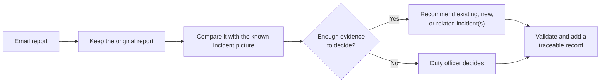
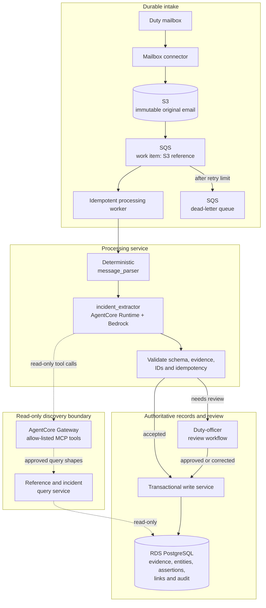

# Production service design

The goal is to turn email reports into a traceable incident picture without
hiding uncertainty or losing the evidence behind a decision.

## What the service changes

This first view shows the service as a duty officer should experience it.

The original email remains evidence. Every recommendation retains its sender,
reported time and supporting words, so an officer can inspect where it came
from.

Email-format handling remains deterministic in `message_parser`. A model is
introduced only in `incident_extractor`, where varied language must be
interpreted against a changing incident history.

## Target AWS architecture

This second view shows the engineering and authority boundaries. It assumes AWS
and Bedrock are accredited for the mailbox's information classification.

Solid arrows move work, route failures or write records. Dashed arrows are the
agent's bounded search path. The model has no database credentials, write tool
or arbitrary-query access.

The intake stores the exact email in encrypted S3 before publishing its
reference. Retries and replay cannot duplicate a source message or the same
version of derived output.

AgentCore Runtime runs the agent with an approved Bedrock model. AgentCore
Gateway exposes read-only Model Context Protocol (MCP) tools; a query service
restricts their scope and result size.

Only application-owned validation and write services create records or route
reviewed corrections. Audit data records message, model, prompt, tool and
reference-data versions.

Email text is untrusted input. Least-privilege IAM, encryption and limits on
tool calls, time and tokens contain the model boundary.

## Generalising beyond Part A

Part A fixes entity, incident and numeric-predicate vocabularies, then applies
line-based rules. The target keeps a stable relational core: canonical entities
and aliases, immutable assertions, typed links and review decisions.

| Part A compromise | Production response |
|---|---|
| Closed types, aliases and predicates | A versioned domain registry defines entity types; relationship types, allowed endpoints, direction and cardinality; and metrics with datatype, unit, population, geography, status/modality and time. Reference owners govern sources, licences, versions, aliases, merges and effective dates. |
| One positional incident and unanchored measurements | The agent searches bounded context and returns existing, new, a typed `caused_by`/`contributes_to`/`related_to` link, or review. It supports provisional, hierarchical and many-to-many incidents; unresolved assertions keep their evidence. |
| Body-only, line-based extraction | Layout, quoted/forwarded, table, attachment and relative-time processors share one assertion contract. Parent part, claim author, forwarding sender, source span and original time phrase survive; gaps remain typed issues. |
| Fixed organisation roles and no site lifecycle | Roles, actions and lifecycle changes are time-bound, message-attributed assertions. Sites can change role; roads can resolve to segments. |
| Resends and duplicate representations | Source-message idempotency stays separate from semantic message and assertion grouping, preserving evidence without double-counting. |

A new type is normally a steward-approved registry change, reference
mapping and labelled examples. The extractor reads the active catalogue at
runtime, so neither pipeline code nor model retraining is normally required.

Each version must pass replay evaluation. New structure or access rules still
require a migration. The agent can propose entries but cannot publish them.

Sensitive, urgent, materially conflicting or ambiguous candidates enter review
under classification-specific access and retention.

Corrections never overwrite. Raw wording and scope survive beside comparable
unit, population, geography and effective-time fields. Assertions link as
`qualifies`, `supersedes` or `contradicts`, retaining both evidence spans.

A versioned “current picture” view applies duty-officer-approved temporal,
spatial, source and review rules. It shows competing reports when those rules
cannot support one answer.

## Proving it is trustworthy

Weeks 1 and 2 produce a labelled corpus from approved examples and officer
decisions. It covers body, table and attachment formats, relative time,
corrections, similar names, multiple incidents, relationships and hostile text.

Duty officers create adjudicated reference decisions. Labeller disagreement is
retained as an abstention or review case rather than being resolved away.

| Stage | Evidence of quality |
|---|---|
| Development | Stratify by entity, metric and format; measure incident merges/splits, relationship and contradiction links, facts, time, evidence and abstention. |
| Security | Replay injection, spoofed senders and over-broad retrieval; require allow-listed tools, validated shapes, authorised reads and logged rejection. |
| Controlled shadow use | Replay approved emails against officer decisions; inspect every proposal, then sample both accepted and review outcomes. |
| Eventual live use | Track officer corrections, abstention, time saved, review backlog, drift by sender/template, latency and cost. |

Duty officers set numeric targets before a pilot. Hard gates include correct
attribution and zero false merges in the agreed high-severity evaluation set.

Numeric facts favour precision over recall. No injection or out-of-scope read
may succeed.

Every model, prompt, tool or reference-data change is replayed against the
versioned corpus. Model confidence alone is not an acceptance gate.

## First six weeks and deliberate omission

| Period | Outcome |
|---|---|
| Week 1 | A user researcher and engineer shadow email triage, spreadsheet updates and handovers. They identify priority questions, incident-linking decisions and costly errors. |
| Week 2 | Establish a versioned relational design for evidence, domain registries, entities, immutable assertions, typed links, review and idempotency. Validate it with officers' priority queries. |
| Weeks 3–4 | Build the read-only query tools, AgentCore extractor, deterministic validation and minimal review workflow. Use controlled replay, not the live mailbox. |
| Weeks 5–6 | Evaluate with duty officers, improve schema and prompts, calibrate abstention, test security and recovery, and decide what is safe to pilot next. |

**Deliberately not built:** live mailbox and SQS-driven ingestion. It is tempting
to demonstrate real-time flow, but it adds operational risk without testing the
hard problem: reliable incident identity and relationship discovery.

S3 and SQS remain in the target architecture. Live integration follows only
when controlled replay demonstrates acceptable quality, review behaviour, data
handling and recovery.
