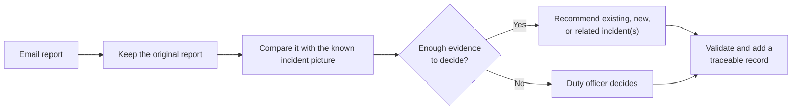
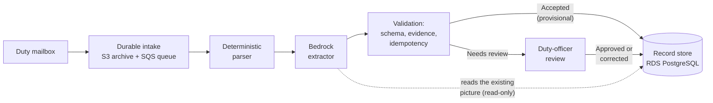
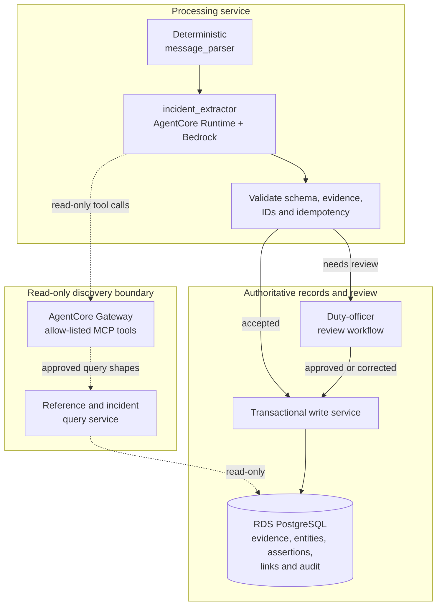

# Production service design

The goal is to turn email reports into a traceable incident picture without
hiding uncertainty or losing the evidence behind a decision.

## What the service changes

This first view shows the service as a duty officer should experience it.

The original email remains evidence. Every recommendation retains its sender,
reported time and supporting words, so an officer can inspect where it came
from.

Email-format handling remains deterministic in `message_parser`. A model is
introduced only in `incident_extractor`, where varied language must be
interpreted against a changing incident history.

## Target AWS architecture

This second view is the stack at a glance. It assumes AWS and Bedrock are
accredited for the mailbox's information classification.

The intake stores the exact email in S3 before publishing its reference;
retries and replay cannot duplicate a source message or the same version of
derived output, and exhausted retries park on a dead-letter queue.

Accepted extractions are recorded as provisional immediately, avoiding
human bottlenecks on fast-path data. Only extractions flagged for review
route through duty-officer approval; both paths write with audit trails
that distinguish provisional from validated assertions.

### Model selection

The extractor uses Claude 3.5 Sonnet via Amazon Bedrock in the London
region. Claude is chosen for reasoning capability, instruction-following,
structured output and bounded tool use. Sonnet balances accuracy, latency
and cost, and is available in the required region. Bedrock Guardrails
filter untrusted input and token/retry limits bound inference.

The third view shows how authority is controlled inside that stack. Solid
arrows move work or write records; dashed arrows are the agent's bounded,
read-only search path.

### Security boundary

- **Framework.** This architecture is designed against the OWASP Top 10 for LLM
  Applications.
- **Bounded read-only access for the model.** The extractor reads only through the
  AgentCore Gateway's allow-listed, read-only MCP tools, with no direct database
  credentials, write access, or arbitrary-query capability. The query service
  restricts scope and result size.
- **Encryption and secrets.** KMS customer-managed keys protect S3 and RDS at
  rest; VPC endpoints keep Bedrock/S3/RDS traffic off the public internet;
  RDS credentials live in Secrets Manager, not in code or logs.
- **Untrusted input.** Email text is untrusted. Bedrock Guardrails filter the
  extractor's input and output, and limits on tool calls, time and tokens
  bound the model.
- **Authority and audit.** Only application-owned validation and write
  services create records or route reviewed corrections. Audit data records
  message, model, prompt, tool and reference-data versions.
- **Data residency.** Bedrock, S3 and RDS run in the AWS London region,
  keeping personal and OFFICIAL-SENSITIVE data in the UK and avoiding UK
  GDPR international-transfer questions; the chosen Bedrock model must be
  available there.

## Generalising beyond Part A

Part A fixes entity, incident and numeric-predicate vocabularies, then applies
line-based rules over a single email body. Three axes generalise it.

### Interpreting incidents, locations and facts

The single top-to-bottom, one-current-incident pass becomes an agent that
searches bounded context and returns an existing incident, a new one, a
typed `caused_by`/`contributes_to`/`related_to` link, or a review case,
supporting provisional, hierarchical and many-to-many incidents. Layout,
quoted/forwarded, table, attachment and relative-time processors share one
assertion contract, so parent part, claim author, forwarding sender, source
span and original time phrase all survive; gaps remain typed issues.

### Growing the reference data

Locations, sites, organisations and predicates stop being a hand-seeded,
closed list. A versioned domain registry defines entity and relationship
types, allowed endpoints and metrics: datatype, unit, population, geography,
time. Within a type, the agent resolves each mention against the registry
via bounded search and proposes a new entity or alias when no match clears
its confidence threshold; a steward publishes it. A new type is the rarer,
steward-led registry change, replay-evaluated before promotion.

For locations and sites, a candidate is cross-checked against an
authoritative public gazetteer, such as OS Names, before it reaches steward
review, so a new entity is grounded in a real place, not model confidence
alone.

### What Part A does not attempt

Corrections never overwrite: assertions link as `qualifies`, `supersedes` or
`contradicts`, keeping both evidence spans when messages conflict.
Organisation roles and site lifecycle become time-bound, message-attributed
assertions instead of fixed facts. Resends stay idempotent at the message
level, separate from semantic assertion grouping, so evidence survives
without double-counting. A message referencing an attachment never received
becomes a typed issue, not a fabricated or silently dropped claim. A versioned "current picture" view applies
duty-officer-approved rules and shows competing reports when those rules
cannot support one answer; sensitive or ambiguous candidates route to
review.

## Proving it is trustworthy

Three loops run continuously, not once before launch.

**Golden-set evaluation.** A labelled set of emails, covering body, table and
attachment formats, relative time, corrections, similar names, multiple
incidents and hostile text, is replayed against every model, prompt, tool or
reference-data change. AgentCore evals measure precision, recall, merges/splits
and abstention per release; regressions block promotion. Duty officers adjudicate
disagreement rather than resolving it away.

**Phased historical backfill.** Real historical emails are loaded in widening
volume, one month, then three, then six, with duty officers manually
reviewing every extraction before the next stage. Corrections drive schema
and prompt changes, and feed the golden set itself.

**Security testing.** Extraction is tested for prompt injection from email body,
sensitive-data leakage through tool calls, and excessive agency. No injection
or out-of-scope read may succeed.

Duty officers set numeric targets before a pilot. Hard gates include correct
attribution, zero false merges in the agreed high-severity set, and
precision over recall on numeric facts. Model confidence alone is not an
acceptance gate.

## First six weeks and deliberate omission

| Period | Outcome |
|---|---|
| Week 1 | A user researcher and engineer shadow email triage, spreadsheet updates and handovers. They identify priority questions, incident-linking decisions and costly errors. |
| Week 2 | Establish a versioned relational design for evidence, domain registries, entities, immutable assertions, typed links, review and idempotency. Validate it with officers' priority queries. |
| Weeks 3–4 | Build the read-only query tools, AgentCore extractor, deterministic validation and minimal review workflow. Use controlled replay, not the live mailbox. |
| Weeks 5–6 | Evaluate with duty officers, improve schema and prompts, calibrate abstention, test security and recovery, and decide what is safe to pilot next. |

**Deliberately not built:**

1. **Live mailbox and SQS-driven ingestion.** Demonstrating real-time flow adds
operational risk without testing the hard problem: reliable incident identity
and relationship discovery. S3 and SQS remain in the target architecture; live
integration follows only when controlled replay demonstrates acceptable quality,
review behaviour, data handling and recovery.

2. **Live AgentCore Gateway MCP tool servers.** MCP server deployment requires
internal governance approval and cross-functional sign-off in a regulated
environment, making it infeasible within six weeks. Controlled replay with mock
tool responses substitutes for live MCP during initial evaluation. Live MCP
integration follows once governance review completes and controlled replay
demonstrates acceptable quality.
