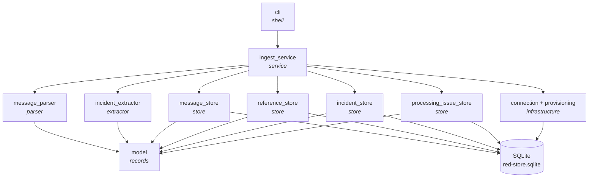
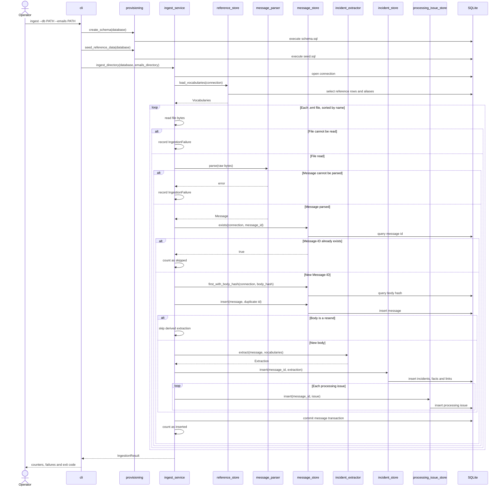

# Part A architecture

Module boundaries and runtime flow for `red_store`. Implements the
[Part A requirements](requirements.md), informed by the
[input data analysis](input-data-analysis.md). The future service belongs in
root `DESIGN.md`.

## Modules

- `cli`: arguments, output, exit codes.
- `provisioning`: schema creation and reference seeding.
- `ingest_service`: ordering and per-message transactions.
- `message_parser`: raw bytes to `Message`. Pure; no file or database access.
- `incident_extractor`: `Message` plus `Vocabularies` to `Extraction`. Pure.
- Stores: SQL for one table or aggregate. No parsing or extraction.
- `model`: shared frozen records.
- `connection`: SQLite connections. `sql/`: packaged schema and seed.

## Dependency rule

Dependencies point inward; never back into orchestration.

```
cli  ->  ingest_service  ->  message_parser
                        ->  incident_extractor
                        ->  store
message_parser      ->  model
incident_extractor  ->  model
store               ->  model
```

Parser, extractor and stores depend on `model`, never on each other or the
workflow. `ingest_service` composes them. Nothing imports `cli`.

`tests/test_architecture.py` enforces the boundaries most vulnerable to
accidental drift: runtime modules remain flat; parser and extractor cannot use
filesystem or SQLite modules; stores cannot depend on transformations or
workflow code; and SQL execution stays out of transformations, `ingest_service`,
`cli` and `model`.

## Component view



## Ingest sequence

Provision once, load vocabularies once, then handle each parsed message in its
own transaction.



## Contracts

- `message_parser.parse(bytes) -> Message` owns RFC/MIME normalization.
- `incident_extractor.extract(Message, Vocabularies) -> Extraction` owns
  interpretation.
- Stores own persistence and resolve extracted natural keys to database IDs.
- `model.py` records are immutable values crossing these boundaries.
- One parsed message and all its derived rows commit together.
- Read or parse failures are collected; write failures propagate.

No interfaces, dependency-injection container, ORM, event bus or plugin layer:
one implementation, one input shape, one SQLite store.
